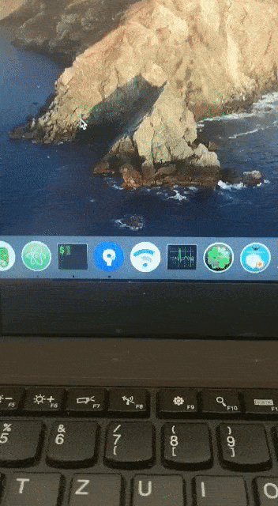

# ThinkPad T450s X250 T450 Big Sur OpenCore 0.6.6


[](https://developer.apple.com/documentation/macos-release-notes)
[](https://github.com/acidanthera/OpenCorePkg)
[](https://pcsupport.lenovo.com/us/en/products/laptops-and-netbooks/thinkpad-t-series-laptops/thinkpad-t450s/downloads/driver-list/component?name=BIOS%2FUEFI)

**免责声明:**
在开始之前，请阅读整个自述文件。
我对您可能造成的任何损失不承担任何责任。
如果您发现错误或有任何改进（无论是在配置中还是在文档中），请考虑打开问题或请求请求。
如果您发现我的工作有用，请考虑通过PayPal捐款。
对我来说意义重大。 

## 简介
- 这是一个完整的ThinkPad T450s macOS + DW1820a Hackintosh 配置。
- 声卡默认 layout-id = 32，耳机杂音请使用声卡修复脚本(ALCPlugFix)。 
- 如果你想使用扩展坞上的音频接口，请将声卡 layout-id 设置为 55 ，选择线路输出。
- 支持触摸屏（带有多点触控和触屏手势）。
- 支持 Catalina。
- 支持 Mojave。
- 支持 ThinkPad X250 ThinkPad T450 ThinkPad T450s。
- 一键开启Hi-DPI  参考:   https://github.com/xzhih/one-key-hidpi

## 硬件信息
```  
- CPU：Intel Core i7-5600U i7-5500u i5-5300U i5-5200U

- 核心显卡：Intel HD 5500 Graphics 

- 声卡：ALC292

- 无线网卡：DW1820A   Intel 7265AC   Intel AX200
```
## Installation

<details>  
<summary><strong>如何安装macOS </strong></summary>
</br>

1. [创建安装媒体](https://dortania.github.io/OpenCore-Install-Guide/installer-guide/#making-the-installer)
1. 下载[最新的EFI文件](https://github.com/CLAY-BIOS/Lenovo-ThinkPad-T450s-Hackintosh-Big-Sur-OpenCore/releases) 并将其复制到ESP分区中
1. 根据下表更改您的BIOS设置 
1. 从USB启动安装程序（按“ F12”选择启动盘），然后[开始安装过程](https://dortania.github.io/OpenCore-Install-Guide/installation/installation-process.html#booting-the-opencore-usb)

</details>

## BIOS (1.37)
-  Security -> Security Chip`: **Disabled**;
-  Memory Protection -> Execution Prevention`: **Enabled**;
-  Virtualization -> Intel Virtualization Technology`: **Enabled**;
-  Internal Device Access -> Bottom Cover Tamper Detection`: must be **Disabled**;
-  Anti-Theft -> Current Setting`: **Disabled**;
-  Anti-Theft -> Computrace -> Current Setting`: **Disabled**;
-  Secure Boot -> Secure Boot`: **Disabled**;
-  UEFI/Legacy Boot`: **UEFI Only**;
-  CSM Support`: **Yes**.

# Intel Wi-Fi
- 驱动文件以添加到项目中，根据自己的系统版本勾选，默认为Big Sur。
- 隔空投送不可用。
- 不讨论Intel Wi-Fi的问题，因为驱动程序不稳定。
- 参考:  https://github.com/OpenIntelWireless/itlwm


# 扩展坞
- 使用扩展坞会导致睡眠出现问题，解决方法是在 config.plist->ACPI 中勾选 SSDT-IGBE 补丁。
- 使用 SSDT-IGBE 补丁无法使用翻盖模式。

# ThinkPad助手(ThinkpadAssistant)
- 可让您在Thinkpad T450s X250 T450笔记本电脑上使用所有功能键。
- 复制ThinkpadAssistant到应用程序文件夹。
- 启动ThinkpadAssistant，并在菜单栏中勾选“登录时启动”。
- F4：麦克风静音/取消静音（带有状态LED指示）。
- F7：屏幕镜像/屏幕扩展。
- F8：启用/停用Wi-Fi。
- 左Shift + F8键：启用/停用蓝牙。
- F9：打开系统偏好设置。
- F12：打开启动板。
- FN + Space：切换键盘背光。
- FN + 4：睡眠快捷键。
（睡眠过程中再次按下睡眠快捷键即可终止睡眠。）
（连接外部显示器时，按睡眠按钮后，工作屏幕变为外部显示器（内部屏幕关闭）；再按一次睡眠按钮，内部和外部显示器恢复正常。）
- PrtSc 映射到 F13：可在系统偏好设置-->键盘-->快捷键将它设置为截图。
-------------------------------------------------------------------------------------------------------------


## 有效
- CPU
- 睡眠/唤醒
- Wifi
- 蓝牙 
- Handoff, Continuity, AirDrop
- iMessage, FaceTime, App Store, iTunes Store
- 以太网卡  （连接扩展坞后无法使用笔记本上的以太网接口）
- 声卡
- USB
- 电池和完整的电池信息   
- 触摸屏 
- 触摸板 
- 小红点
- miniDP
- SD卡读卡器
- 扩展坞 USB
- 扩展坞 以太网
- 扩展坞 音频 （需要将声卡 layout-id 设置为 55 ）

## 无效
- VGA
- 指纹
- 扩展坞 DisplayPort
- 扩展坞 VGA
- 扩展坞 DVI
- 扩展坞 HDMI

> ## 学分

- [@tylernguyen](https://github.com/tylernguyen/x1c6-hackintosh) 新一代电池补丁。
- [@zhen-zen](https://github.com/zhen-zen) for YogaSMC.
- [daliansky/OC-little](https://github.com/daliansky/OC-little) 各种ACPI热补丁样本。 
- [@xzhih](https://github.com/xzhih) 一键开启Hi-DPI。 
- [@cholonam](https://github.com/cholonam/Sinetek-rtsx) 读卡器修复. https://github.com/cholonam/Sinetek-rtsx/pull/18
- [@MSzturc](https://github.com/MSzturc/ThinkpadAssistant) ThinkPad助手。
- [@zxystd](https://github.com/OpenIntelWireless/itlwm) Intel Wi-Fi Drivers for macOS.

非常感谢 [Acidanthera](https://github.com/acidanthera) 团队，如果没有他们的工作，这将是不可能的。

欢迎提问，但请不要问太低级的问题。
